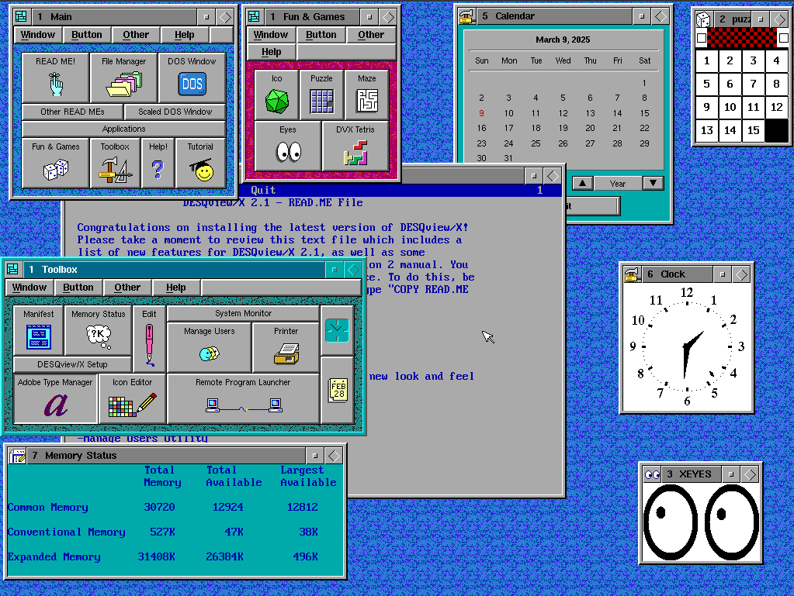

# Desqview/X + MSDOS 6.22



A complete fresh install of Desqview/X on emulated hardware

✅ SVGA 256 Color

✅ PS/2 Mouse with DOS Driver

✅ QEMM 9 


## Hardware Emulated:

| Hardware Component       | Specification/Value              |
|--------------------------|----------------------------------|
| machine                  | 686nx                            |
| cpu_family               | pentiumpro                       |
| cpu_speed                | 120 MHz                          |
| cpu_multi                | 2                                |
| mem_size                 | 32 MB RAM                        |

## Getting started

Once the machine boots, start desqview like this:
```
C:\> cd dvx

C:\DVX> dvx
```